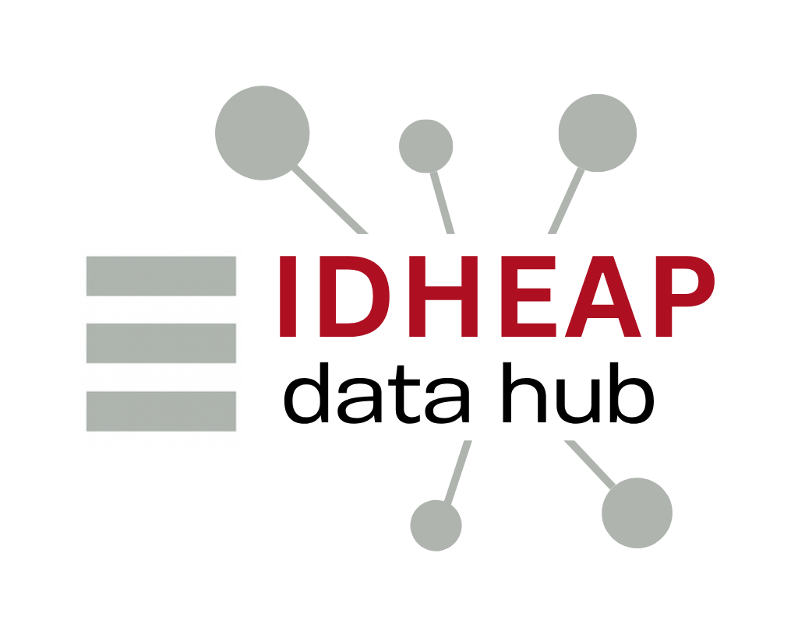

   

# IDHEAP DataHub

Longitudinal geographic data visualisation project.

## Setup and usage

### Traditional installation

This project requires:
- [Python](https://www.python.org/) 3.12+ (EOL 2029-10).
- [Node.js](https://nodejs.org/) v.24.4+ (EOL 2028-04).
- A working [PostgreSQL](https://www.postgresql.org/)+[PostGIS](https://postgis.net/) database.

Selected guides are available here:
- [Debian installation](./docs/debian_install.md).
- [RHEL installation](./docs/rhel_install.md).

Then, you can install and run the actual webapp:
- Manual: [Webapp installation](./docs/webapp_install.md).
- Automatic: [Makefile installation](./docs/makefile_install.md).

### Docker

Please refer to the Docker documentation:
- Docker: [Docker installation](./docs/docker_install.md).

## Contributing

If you are a dev, please refer to our [CONTRIBUTING](CONTRIBUTING.md) file, and don't forger to activate [`pre-commit`](https://pre-commit.com/):
- `pre-commit install`

### Academic contributors

<table>
  <tbody>
    <tr>
      <td align="center" valign="top" width="14.28%"><a href="https://github.unil.ch/schoenol/"> <b>schoenol</b></a> Project manager</td>
    </tr>
  </tbody>
</table>

### Technical contributors

<table>
  <tbody>
    <tr>
      <td align="center" valign="top" width="14.28%"><a href="https://github.unil.ch/hhueber/"> <b>hhueber</b></a> Lead Developer</td>
      <td align="center" valign="top" width="14.28%"><a href="https://github.unil.ch/Karilla/"> <b>Karilla</b></a> Developer</td>
      <td align="center" valign="top" width="14.28%"><a href="https://github.unil.ch/Np93/"> <b>Np93</b></a> Developer</td>
      <td align="center" valign="top" width="14.28%"><a href="https://github.unil.ch/matthieujacques/"> <b>matthieujacques</b></a> Former developer</td>
    </tr>
  </tbody>
</table>

## License

Copyright (c) 2025 Université de Lausanne - IDHEAP.

Please refer to our [LICENSE](./LICENSE.md) file.

## Contact

Feel free to get in touch by [email](mailto:helpdesk@unil.ch?subject=%5BDCSR%2C%20FDCA%2C%20DataHub%5D%20I%20want%20to%20get%20in%20touch!)!
