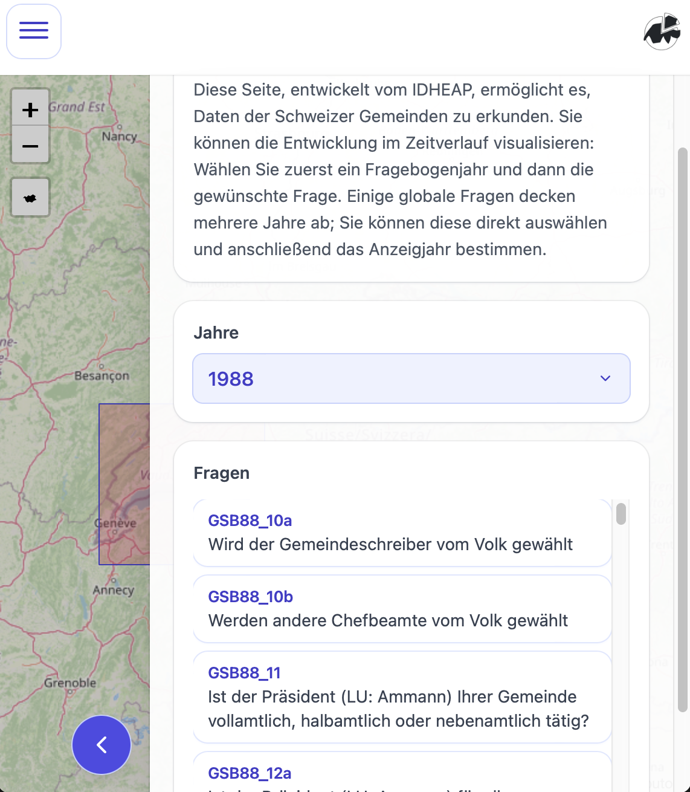
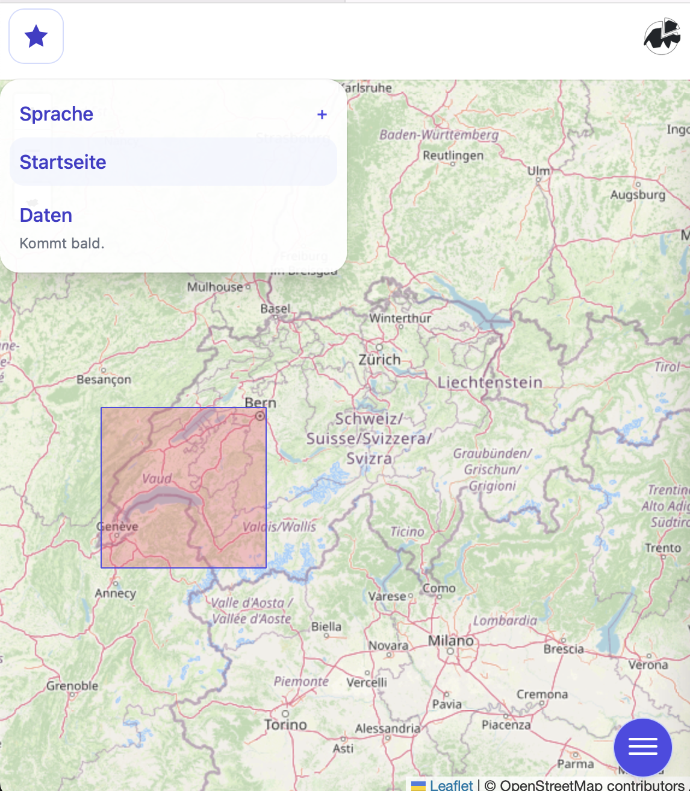

# IDHEAP Datahub

Projet de visualisation de données géographiques longitudinales.

## Setup

1. Clone the repo, go into it.
   - `git clone git@github.com:hhueber/IDHEAP-Datahub.git; cd IDHEAP-Datahub`
2. Create a [virtual environment](https://docs.python.org/3/library/venv.html), and activate it.
   - `python -m venv ./env; source ./env/bin/activate`
3. Install requirements.
   - `pip install -Ur requirements.txt`
4. Activate [`pre-commit`](https://pre-commit.com/).
   - `pre-commit install`
5. _Tada_

## Aperçu du front

Voici quelques captures d’écran du frontend pour une premiere impression:

